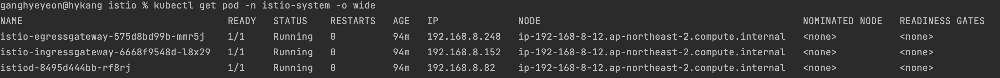

# Istio 개념
istio mesh 안에서 트래픽을 ingress traffic, mesh traffic, egress traffic이 있다.
### Istio Ingress
### Istio Gateway
Gateway는 mesh의 끝에서 나가고 들어오는 트래픽을 받는 로드밸런서로 동작
### Istio Virtual Service
어떻게 destination으로 트래픽을 route 할 것인지
### Destination Rule
destination으로 간 traffic이 어떻게 처리되는지
## Istio Components

### Data Plane
#### Envoy proxy
* service mesh 안의 트래픽을 중개하는 프록시
* service의 sidecar로 배포됨
* 기능
  * Dynamic service discovery
  * Load balancing 
  * TLS termination → 통신 암호화
  * HTTP/2 and gRPC proxies 
  * Circuit breakers → 장애가 전파되는 것을 막기 위해서 특정 서비스에 장애가 발생하면 다른 서비스가 장애가 발생한 서비스를 기다리지 않도록 하는 것
  * Health checks 
  * Staged rollouts with %-based traffic split 
  * Fault injection 
  * Rich metrics
### Control Plane
#### Istiod
* envoy 프록시를 파드 안에 주입
* service discovery, configuration, certificate management 기능이 있음
#### Pilot
driver of Istio
#### Citadel
security
#### Mixer
sidecar의 central point

출처: 

https://istio.io/latest/docs/ops/deployment/architecture/
# Istio 실습
### Istio gateway & virtual service 배포

#### istio ingress pod 로그
```shell
[2022-06-16T08:56:42.617Z] "GET / HTTP/1.1" 404 NR route_not_found - "-" 0 0 0 - "192.168.9.216" "Mozilla/4.0 (compatible; MSIE 8.0; Windows NT 6.1; WOW64; Trident/4.0; SLCC2; .NET CLR 2.0.50727; .NET CLR 3.5.30729; .NET CLR 3.0.30729; Media Center PC 6.0; .NET4.0C)" "1e3c1134-6a1a-9b08-bd2a-5618e9a04cdb" "www.zgwangzhan.com" "-" - - 192.168.8.152:8080 192.168.9.216:10840 - -
```
## Book Info 실습
### kubectl get all
#### `kubectl get all`
```shell
NAME                                  READY   STATUS    RESTARTS   AGE
pod/details-v1-7d88846999-9pqjm       1/1     Running   0          4m20s
pod/productpage-v1-7795568889-6ksrq   1/1     Running   0          4m19s
pod/ratings-v1-754f9c4975-hbqw7       1/1     Running   0          4m20s
pod/reviews-v1-55b668fc65-pqph7       1/1     Running   0          4m19s
pod/reviews-v2-858f99c99-nhqtp        1/1     Running   0          4m19s
pod/reviews-v3-7886dd86b9-zr8ws       1/1     Running   0          4m19s

NAME                  TYPE        CLUSTER-IP       EXTERNAL-IP   PORT(S)    AGE
service/details       ClusterIP   10.100.152.183   <none>        9080/TCP   4m21s
service/kubernetes    ClusterIP   10.100.0.1       <none>        443/TCP    17m
service/productpage   ClusterIP   10.100.1.85      <none>        9080/TCP   4m19s
service/ratings       ClusterIP   10.100.199.170   <none>        9080/TCP   4m20s
service/reviews       ClusterIP   10.100.237.132   <none>        9080/TCP   4m20s

NAME                             READY   UP-TO-DATE   AVAILABLE   AGE
deployment.apps/details-v1       1/1     1            1           4m20s
deployment.apps/productpage-v1   1/1     1            1           4m19s
deployment.apps/ratings-v1       1/1     1            1           4m20s
deployment.apps/reviews-v1       1/1     1            1           4m19s
deployment.apps/reviews-v2       1/1     1            1           4m19s
deployment.apps/reviews-v3       1/1     1            1           4m19s

NAME                                        DESIRED   CURRENT   READY   AGE
replicaset.apps/details-v1-7d88846999       1         1         1       4m20s
replicaset.apps/productpage-v1-7795568889   1         1         1       4m19s
replicaset.apps/ratings-v1-754f9c4975       1         1         1       4m20s
replicaset.apps/reviews-v1-55b668fc65       1         1         1       4m19s
replicaset.apps/reviews-v2-858f99c99        1         1         1       4m19s
replicaset.apps/reviews-v3-7886dd86b9       1         1         1       4m19s
```
#### `kubectl get all -n istio-system`
```shell
NAME                                        READY   STATUS    RESTARTS   AGE
pod/istio-egressgateway-575d8bd99b-knrjh    1/1     Running   0          6m15s
pod/istio-ingressgateway-6668f9548d-pvrkk   1/1     Running   0          6m15s
pod/istiod-8495d444bb-ls4bg                 1/1     Running   0          6m28s

NAME                           TYPE           CLUSTER-IP      EXTERNAL-IP                                                                   PORT(S)                                                                      AGE
service/istio-egressgateway    ClusterIP      10.100.193.5    <none>                                                                        80/TCP,443/TCP                                                               6m15s
service/istio-ingressgateway   LoadBalancer   10.100.202.19   aa39194acbbac423faf85ed49b3b67c4-640780309.ap-northeast-2.elb.amazonaws.com   15021:30753/TCP,80:31952/TCP,443:30186/TCP,31400:32269/TCP,15443:30312/TCP   6m15s
service/istiod                 ClusterIP      10.100.19.118   <none>                                                                        15010/TCP,15012/TCP,443/TCP,15014/TCP                                        6m27s

NAME                                   READY   UP-TO-DATE   AVAILABLE   AGE
deployment.apps/istio-egressgateway    1/1     1            1           6m15s
deployment.apps/istio-ingressgateway   1/1     1            1           6m15s
deployment.apps/istiod                 1/1     1            1           6m28s

NAME                                              DESIRED   CURRENT   READY   AGE
replicaset.apps/istio-egressgateway-575d8bd99b    1         1         1       6m15s
replicaset.apps/istio-ingressgateway-6668f9548d   1         1         1       6m15s
replicaset.apps/istiod-8495d444bb                 1         1         1       6m28s
```
service/istio-ingressgateway가 15021 port를 expose한 이유는 health check
</br> service/istiod 포트

15010	GRPC	XDS and CA services (Plaintext, only for secure networks)	</br>
15012	GRPC	XDS and CA services (TLS and mTLS, recommended for production use) </br>	
15014	HTTP	Control plane monitoring
#### `istioctl proxy-status`
```shell
NAME                                                   CLUSTER        CDS        LDS        EDS        RDS          ECDS         ISTIOD                      VERSION
istio-egressgateway-575d8bd99b-knrjh.istio-system      Kubernetes     SYNCED     SYNCED     SYNCED     NOT SENT     NOT SENT     istiod-8495d444bb-ls4bg     1.14.1
istio-ingressgateway-6668f9548d-pvrkk.istio-system     Kubernetes     SYNCED     SYNCED     SYNCED     SYNCED       NOT SENT     istiod-8495d444bb-ls4bg     1.14.1
```
https://istio.io/latest/docs/examples/bookinfo/

### 모니터링 구축
```shell
helm install grafana grafana/grafana \
    --namespace grafana \
    --set persistence.storageClassName="gp2" \
    --set persistence.enabled=true \
    --set adminPassword='...' \
    --values grafana-helm.yaml \
    --set service.type=LoadBalancer \
    --set service.name='khy-grafana'
```

